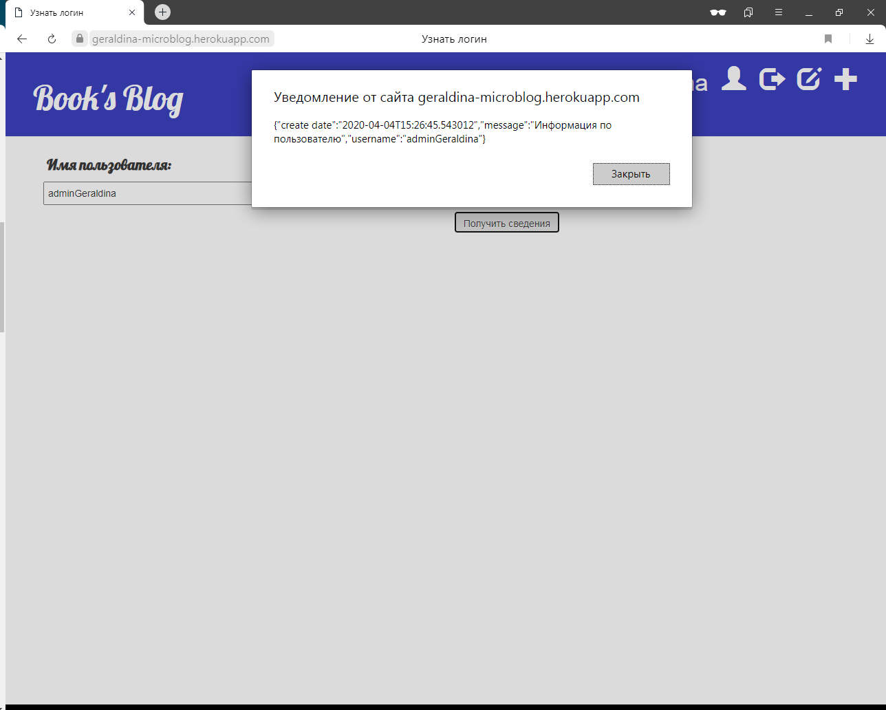
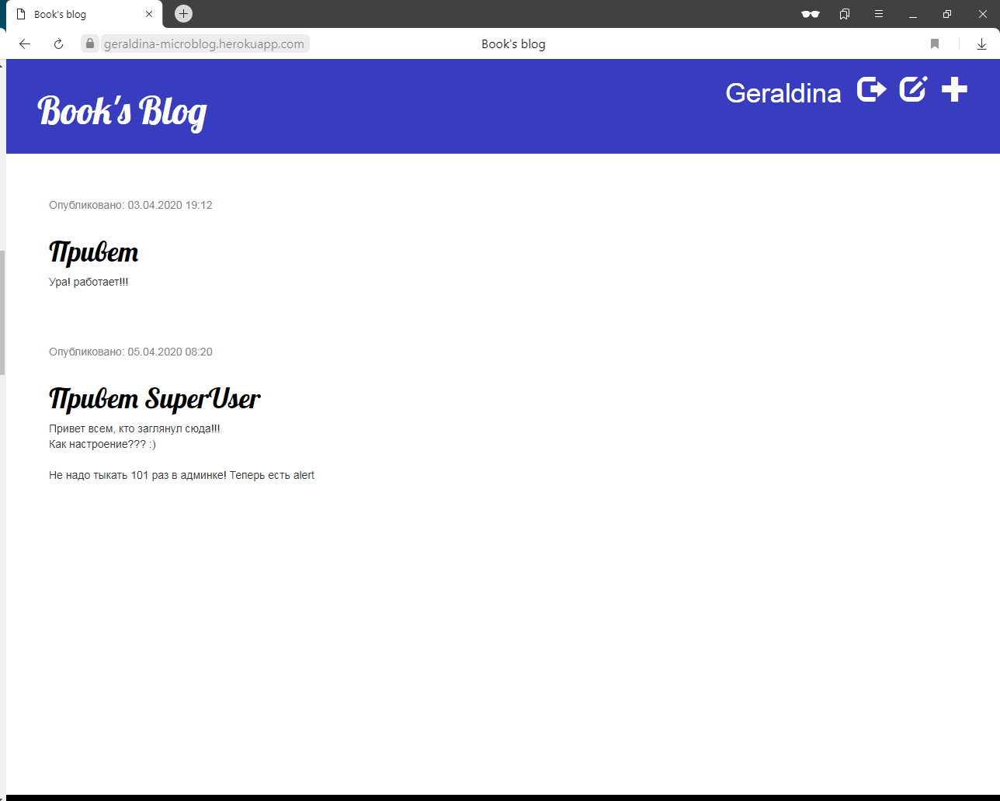

# Блог на Flask и MongoDB

Визульно похож на [блог на Django](https://github.com/ggeraldina/django_blog), но имеет ряд дополнений

* Регистрация новых пользователей
* Особые права у админа

# Заметки

[NOTE.md](NOTE.md)

# Интерфейс

Перечень опубликованных статей. Меню незарегестрированного пользователя

    

Регистрация нового пользователя

    

Список черновых статей. Меню админа

    

Запрос информации о пользователе. Доступно только админу

    

Перечень опубликованных статей. Меню обычного пользователя

    

